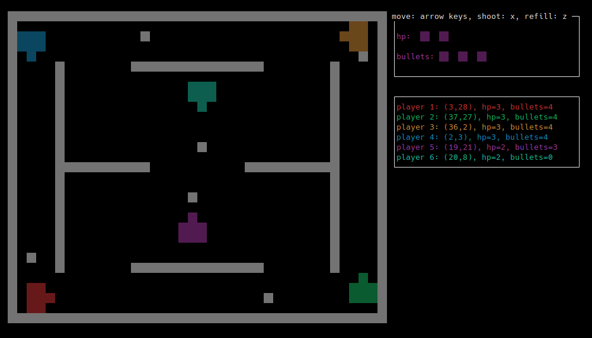

# Tank Game
Tank Game is a multi user shooting game made in C.


## Dependencies
* Debian based distro:
```
sudo apt install make gcc libncurses5-dev -y
```

## Usage
Download the code and compile:
```
git clone https://github.com/9501sam/tank-game.git
cd tank-game/
make 
```

server:
```
./server <Port>
```

client:
```
./client <IP address> <port>
```

## using docker
```sh
make image
docker run -it tank-game/server
```
